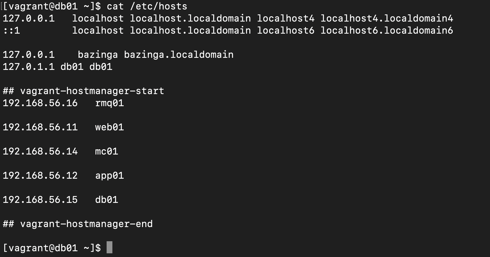

# Project-01: Setup Web Application Stack on Local Machine 

In this project we will setup the Web Application Stack on the local machine using, this stack includes following tools and services.

- NGINX: This will be act as load balancer and forward user requests to the Apache Tomcat application server.

- Apache Tomcat: This will be our application server to deploy the java web application.

- RabbitMQ: Used as message broker for the application.

- Memcached: Used to cache data from the MySQL database server for faster user performance. 

- MySQL: Database server for the application.


## Pre-requisite 

- Oracle Virtual Box (for Windows)/ VMware Fusion Tech (for MacOS)
- Vagrant (for VM automation)
- Vagrant Plugin (vagrant-hostmanager/vagrant-vbguest/vagrant-vmware-desktop) 
- Git
- JDK8
- Maven 
- IDE (VSCode)


## Architecture 


## Step 1: Setup Virtual Machines

Clone the repository

```
git clone https://github.com/vijaylondhe/vprofile-project.git
```

```
cd vagrant/Manual_provisioning_MacOSM1
```

Run the virtual machines

```
vagrant up
```

Note: This will bring up all the virtual machines listed in Vagrantfile, execute the below command to see the status of virtual machines 

```
vagrant status
```


Login into MySQL Virtual Machine:

```
vagrant ssh db01
```

Check host file is automatically updated by host-manager vagrant plugin.

```
cat /etc/hosts
```




Update the repository and install MariaDB package

```
sudo yum update -y
```

```
sudo yum install epel-release -y 
```

```
sudo yum install git mariadb-server -y

```

Start and Enable MariaDB server

```
systemctl start mariadb
systemctl enable mariadb
```

Run the database installation script 

```
mysql_secure_installation
```

Set user password: admin123
Remove Anonymous User? Y
Disallow root login remotely? Y
Remove test database and access to it? Y
Reload privilege tables now? Y  