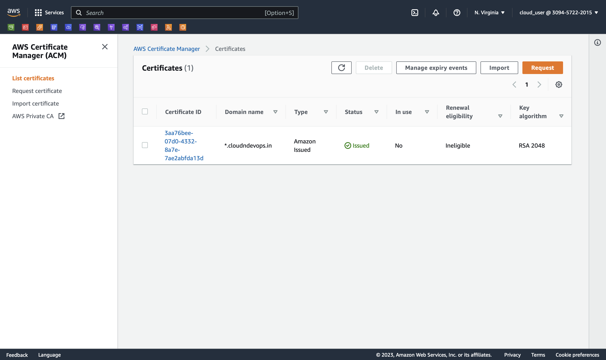

# Project-03: Lift and Shift the WebApplication on AWS 

In this project we will setup the web application stack on the AWS cloud.

Following AWS services will be used 

- EC2
- ELB
- Auto Scaling 
- EBS/EFS
- Route53
- IAM
- ACM
- S3 

## Flow of execution:

- Login to the AWS account.
- Create key pair to access the instances.
- Create Security groups, so that only required ports will be opened on the instances. 
- Launch the EC2 instances with userdata.
- Update the IP addresses in Route53. 
- Build the application from the source code.
- Upload the artifact to S3 storage.
- Download the artifact from S3 to EC2 tomcat instance.
- Setup the ELB with HTTPS (Use ACM for SSL certifiacte).
- Map the ELB endpoint url to website name in DNS provider (e.g. GoDaddy).
- Verify the application. 

## Architecture 

### Create Certificate in AWS Certificate Manager (ACM)

- Login to the AWS account 

- Go to Certificate Manager service and click on Request a Certificate 

- Select certificate type as public certificate and click next

- Enter the domain name and DNS validation method as show in below and click on Request 

- You will see Certificate ID and the status as "pending"

- Click on Certificate ID copy the CNAME name and CNAME value and create CNAME record in your DNS provider (e.g. GoDaddy)

- After some time you will see the certifiacte status as "Issued"

