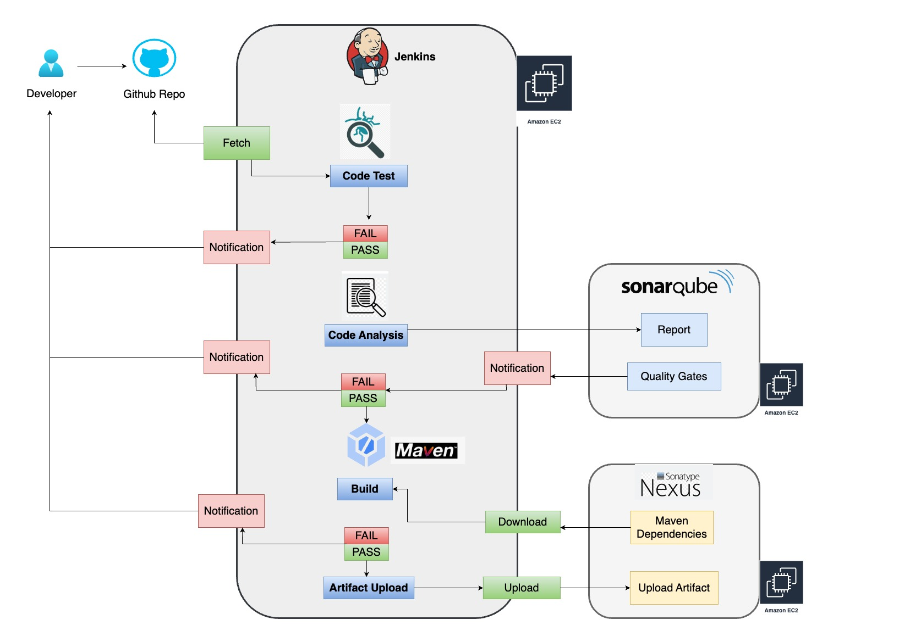

# Project-05: Continous Integration with Jenkins, Sonarqube, Nexus and Slack

### Objectives:

- Build and Test the source code for every commit made by developer. 
- Setup completely automated process.
- Notify to developer for every build status.
- Fix the code if error or bug found instantly rather than waiting.
- Fault isolation.
- Short MTTR (Mean Time to Repair).
- Fast turn around on new feature changes.
- Less dispruptive.

### Tools Used:

- Jenkins: Continous integration server
- Git/GitHub: Version control system
- Maven: To build the code 
- Checkstyle: To analysis the code
- Slack: For the notification
- Sonatype Nexus: To store the artifact and download the dependency for maven 
- Sonarqube: To analysis the code using sonar scanner and publish the report to dashboard
- AWS EC2: Compute resource to host all this tools

### CI Workflow:

### Flow of Execution:

- Login to AWS
- Create key pair
- Create Security group for Jenkins, Sonarqube and Nexus
- Create EC2 instance with user data for Jenkins, Sonarqube and Nexus
- Post Installation
  - Jenkins setup and plugins
  - Nexus setup and repository setup 
  - Sonarqube login test
- Git
  - Create github repository & migrate code 
  - Integrate github repo with vscode and test it
- Build job with nexus integration 
- Setup Github Webhook
- Sonarqube server integration
- Nexus artifact upload stage
- Slack notification

### Architecture:

