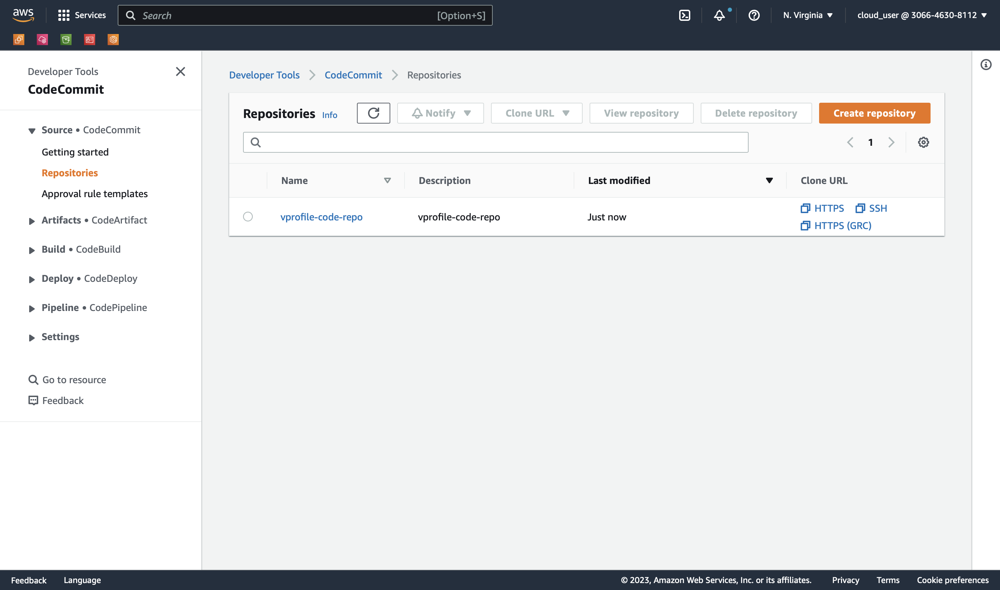
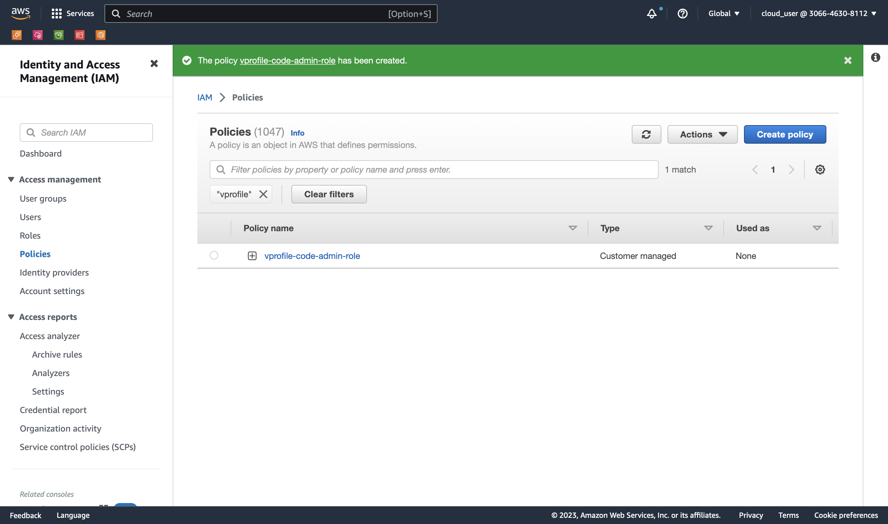
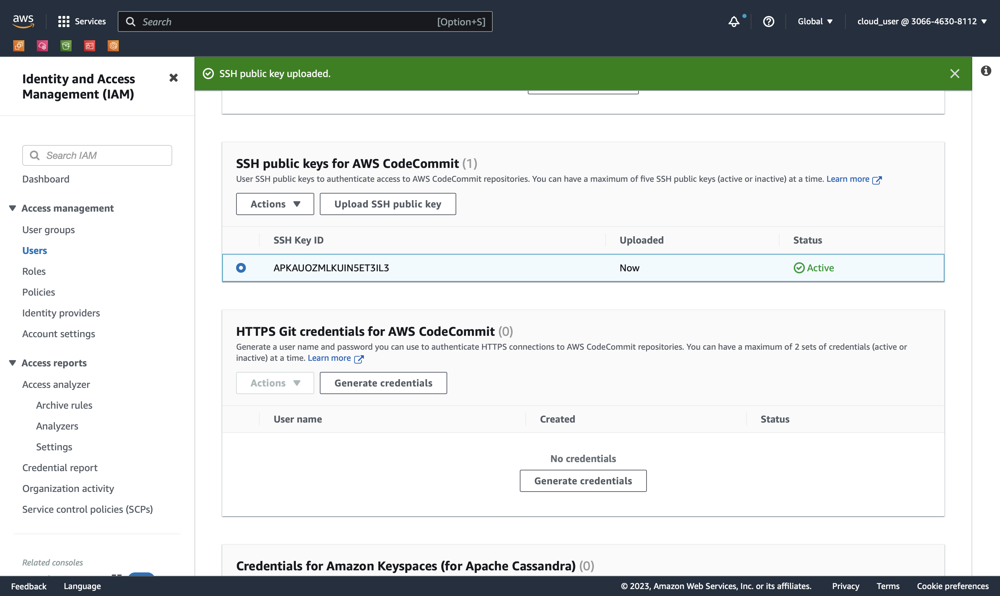

# Project-06: Continuous Integration with AWS

### Objectives:

- In this project, instead of jenkins as countinous integration server we will use AWS managed services to build and test our source code. 

- This will reduce the operational overhead to manage the servers deployed for jenkins, nexus repository and sonarqube.


### Tools/Services Used:

- AWS CodeCommit
- AWS CodeBuild
- AWS CodeArtifact
- AWS CodePipeline
- AWS Systems Manager
- AWS S3 
- SonarCloud

### Architecture:


### Flow of Execution:

- Login to AWS account
- CodeCommit:
  - Create CodeCommit Repo
  - Create IAM user with CodeCommit policy
  - Generate SSH Keys locally
  - Exchange keys with IAM user
  - Put source code from github repo to CodeCommit repo and push
- CodeArtifact:
  - Create IAM user with CodeArtifact access
  - Install AWS CLI and configure
  - Export auth token
  - Update settings.xml file in source code top level directory with below details
  - Update pom.xml file with repo details 
- Sonar Cloud:
  - Create sonar cloud account 
  - Generate the token 
  - Create SSM paramter with sonar details 
  - Create Build project 
  - Update CodeBuild role to access SSM parameter store
- Create notifications for sns or slack
- Build Project:
  - Update pom.xml with artifact version with timestamp
  - Create variables in SSM => parameter store
  - Create build project 
  - Update codebuild role to access SSM parameter store
- Create Pipeline:
  - CodeCommit
  - Testcode
  - Build
  - Deploy to S3 bucket
- Test the Pipeline


### Step 1: Create CodeCommit Repo and IAM User:

- Login to AWS Console 
- Go to CodeCommit Service
  - Create New Repository
  - Name: `vprofile-code-repo`



- Create IAM role for CodeCommit:
  - Click on create new role
  - Add Permissions => Create Policy
  - Choose Service => CodeCommit 
  - In Actions => Click on All CodeCommit actions 
  - In Resources => Select Specific => Add ARN (Provide Region and Repository Name)

    

  - Click on Add
  - Click on Tags => Review 
  - Policy Name: `vprofile-code-admin-policy`
  - Click on Create Role
  - Attach new policy: `vprofile-code-admin-policy`
  - Click Next 
  - Provide Role Name: `vprofile-code-admin-role`
  - Click on Create Role




- Create IAM user 
  - Create user
  - Name: `vprofile-code-admin`
  - Attach Policy `vprofile-code-admin-policy`


- Create SSH keys in local system
  - Execute `ssh-keygen` command
  - Provide the path for the keys 


- Upload SSH keys to IAM user
  - Go to IAM user
  - Select the user `vprofile-code-admin`
  - Go to security credentials
  - Upload the keys in SSH Public Keys for CodeCommit
  - Copy the content of `.ssh/vprofile-repo_id_rsa.pub` and paste it.



- Create config file for the codecommit
  - Go to `cd ~/.ssh`
  - Create file `vim config`
  ```
  Host git-codecommit.us-east-1.amazonaws.com
    User <SSH_Key_ID_from IAM_user>
    IdentityFile ~/.ssh/vprofile-repo_id_rsa
  ```

  - Test the SSH connection with CodeCommit
  ```
  ssh git-codecommit.us-east-1.amazonaws.com
  ```


- Clone the github repository in local and convert this repository to codecommit repository

- Use this repository location: `https://github.com/devopshydclub/vprofile-project.git` 

```
git checkout master
git branch -a | grep -v HEAD | cur -d'/' -f3 | grep -v master > /tmp/branches
for i in `cat  /tmp/branches`; do git checkout $i; done
git fetch --tags
git remote rm origin
git remote add origin ssh://git-codecommit.us-east-1.amazonaws.com/v1/repos/vprofile-code-repo
cat .git/config
git push origin --all
git push --tags
```
- Go to the CodeCommit service and check `vprofile-code-repo` repository have added files from our local repository.


